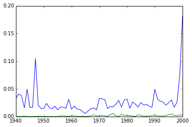

``google_ngrams_py``
================

A class to fetch results from Google Ngrams Viewer and return them as pandas dataframes

###EXAMPLE:#

    from google_ngram import *
    # this is safe because there's just the one class, named Gngram
    import matplotlib.pyplot as plt
    %matplotlib inline
    
    g = Gngram(['google', 'ngram'], years=[1940, 2000], case_insensitive=True)
    
    print g.df_parents.head()
    
    plt.plot(g.df_parents.index, g.df_parents)

Output:

          google (All)  ngram (All)
    1940  0.033068      0.000000
    1941  0.040585      0.000000
    1942  0.037307      0.000000
    1943  0.015727      0.001123
    1944  0.049249      0.000000

###DOCSTRING:#

	Searches Google Ngram Viewer for search terms and creates pandas dataframes of results
	    
	    Arguments: ngrams must be list
	               years is list of length 2, endpoints (inclusive)\
	               corpus: 15 is English
	               If case_insensitive = True, will return df_parents and df_expansion;
	                   otherwise just df_parents
	    
	    Dataframe objects:
	             df_parents: a dataframe with years as Index and search terms as columns and
	                         words per million words as value
	             df_expansion: similar, but with df_parent columns expanded in different cases
	                           where applicable (e.g. the, The, THE)
	                           
	    Dict objects (not necessarily useful, but included for the sake of thoroughness):
	             ngram_type: dict of column name : Goolge ngram defined type, 
	                         e.g. {"the (All): NGRAM", "the": "expansion" ... }
	             parent_expansion: dict of parent column name : list of expansion column names
	                               e.g. {"the (All)": ["The", "the", "THE"]}
	             expansion_parent: dict of expansion column name: parent column name
	                               e.g. {'the': 'the (All)', 'The', 'the (All)', ...}
	                               
	    Other:
	             html: the raw html returned from Google Ngrams Viewer
	             json: the json object of results extracted from the raw html (it's inline in the html)
	             url: the Google Ngrams Viewer url that returned the results.

